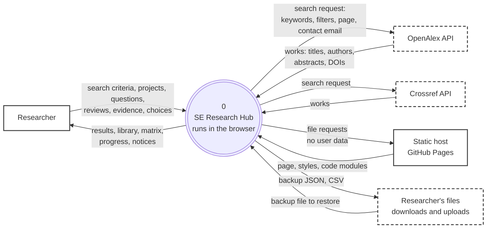
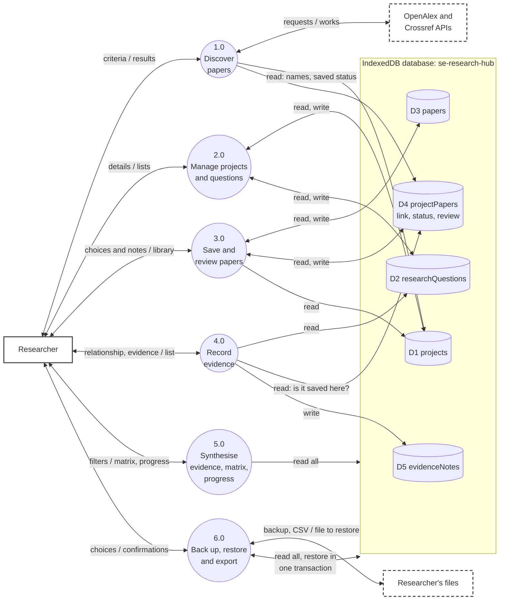
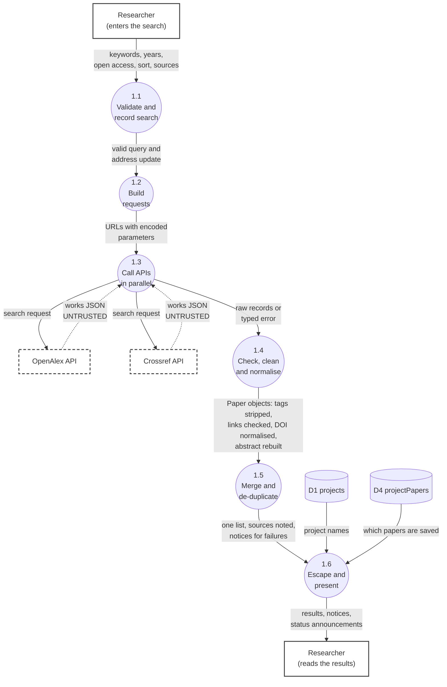
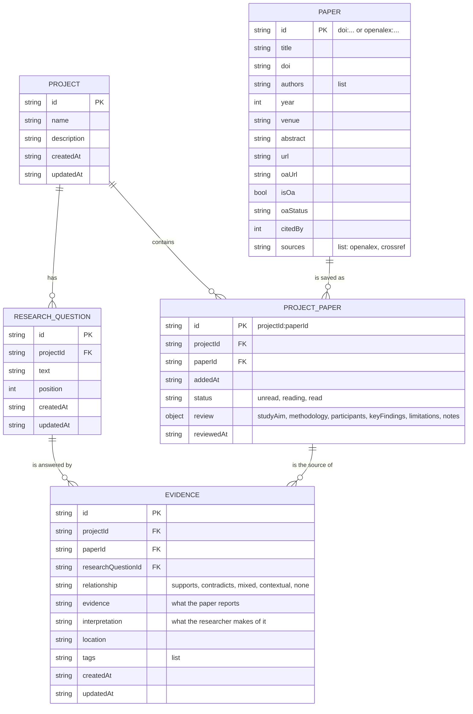

# Data flow and data model

Notation (Yourdon/DeMarco style): **rectangles** are external entities, **circles** are processes (numbered), **cylinders** are data stores (D1…), arrows are labelled data flows. Dashed borders mark data that comes from **outside the trust boundary** (untrusted until checked).

## 1. Context diagram (level 0)

<!-- diagram: dfd-level-0 -->

What never leaves the browser: the Researcher's projects, questions, reviews and evidence. Only the **search request** is sent to a third party (the two scholarly APIs), plus the contact email set in `js/config.js`. The static host sees only requests for the app's own files.

## 2. Level 1: main processes and data stores

<!-- diagram: dfd-level-1 -->

A double-headed line is one flow in each direction (the labels read "in / out"). Arrows into a store are writes, arrows out of a store are reads; a double-headed line to a store is both. **D6 preferences** (`localStorage`: theme, last project, last backup date) is used by the page shell and by 3.0 and 6.0 and is left off the diagram for clarity.

### Flow dictionary (level 1)

| Process | Inputs | Outputs | Reads | Writes |
|---|---|---|---|---|
| 1.0 Discover papers | Keywords, years, sort, open-access flag, chosen sources | Merged results, source notices, "saved to" status | D1 (project names), D4 (what is saved) | none |
| 2.0 Manage projects and questions | Project name and description; question text | Project and question lists, counts | D1, D2 | D1, D2 |
| 3.0 Save and review papers | Chosen paper and project; reading status; structured review text | Library, paper pages | D1, D3, D4 | D3 (paper), D4 (link, status, review) |
| 4.0 Record evidence | Question, relationship, evidence, interpretation, location, tags | Evidence list for the paper | D2, D4 (integrity checks) | D5 |
| 5.0 Synthesise | Filters; project choice | Evidence page, matrix, progress | D1 to D5 | none |
| 6.0 Back up, restore and export | Choice of export; a backup file; confirmation | Backup JSON, CSV files; restore result | D1 to D5 | D1 to D5 (restore only, all-or-nothing) |

## 3. Level 2: process 1.0 Discover papers

This is where untrusted data first enters. Every step between the API reply and the screen exists to make it safe and consistent.

<!-- diagram: dfd-level-2-discover -->

| Step | What it does | Code |
|---|---|---|
| 1.1 | Accessible validation (keywords 2 to 200, years, at least one source); search stored in the address with `pushState` | `js/ui/forms.js`, `js/views/discover.js` |
| 1.2 | Builds each provider's URL (filters, sort, paging, contact email) with `URLSearchParams`, so text is always encoded | `js/api/openalex.js`, `js/api/crossref.js` (`buildSearchUrl`) |
| 1.3 | Runs both requests together; 15 s timeout; cancellable; maps failures to typed errors | `js/api/search.js` (`searchAll`) |
| 1.4 | Checks the response shape; strips markup from titles; decodes entities; accepts only http(s) links; normalises DOIs; rebuilds OpenAlex's inverted-index abstract; cleans Crossref's JATS XML | `js/api/paper.js`, `normaliseWork`, `normaliseItem` |
| 1.5 | Same DOI (or same title and year) becomes one paper; the preferred source wins conflicts and gaps are filled | `js/api/merge.js` |
| 1.6 | Everything is HTML-escaped when drawn; the result count is announced to screen readers | `js/ui/dom.js` (`esc`), `js/ui/announcer.js` |

## 4. Data model

<!-- diagram: data-model -->

### Data stores

| Store | Key | Indexes | Notes |
|---|---|---|---|
| D1 `projects` | `id` (UUID) |  | Deleting a project removes its D2, D4 and D5 rows, then any D3 paper nothing links to |
| D2 `researchQuestions` | `id` | `projectId` | Numbered by `position` (RQ1, RQ2…); deleting removes its D5 rows |
| D3 `papers` | `id` (`doi:…`, or `openalex:…` when there is no DOI) | `doi` | **One shared record per paper**, however many projects use it |
| D4 `projectPapers` | `projectId:paperId` | `projectId`, `paperId` | Holds the **per-project** reading status and structured review, so the same paper can be read differently in two projects; the composite key makes duplicate saves impossible |
| D5 `evidenceNotes` | `id` | `projectId`, `paperId`, `researchQuestionId` | Integrity: the paper must be saved in the project and the question must belong to it; removing the paper link removes this project's evidence for that paper only |
| D6 preferences | n/a (`localStorage`) | | `seh-theme`, `seh-last-project`, `seh-last-backup`: small conveniences only, never research data |

### Why this shape
- **Evidence and interpretation are separate fields** so the method (report versus infer) is built into the data, and exports keep them apart.
- **Review and status live on the link (D4), not on the paper (D3)**, because they belong to a paper *in a project*.
- **One paper record, many links** avoids duplicated metadata and lets a paper be refreshed once.
- **IndexedDB, not `localStorage`**: structured records, indexes for lookups, much larger quota, and transactions (used for atomic restore and cascade deletes).

## 5. Data flow rules that matter for safety

| Rule | Where enforced |
|---|---|
| Nothing from an API reaches D3 without passing step 1.4, then the field whitelist `validatePaper` | `js/api/*`, `js/validation.js` |
| Nothing from a backup file reaches any store without full validation and a field-by-field copy | `js/backup.js` |
| Writes that span stores happen in **one transaction** (restore, project delete, remove-paper) | `js/db/repository.js` |
| Untrusted text is escaped at the moment it is drawn, never stored pre-escaped | `esc()` in every view |
| Exported CSV cells that look like formulas are neutralised | `js/export.js` (`csvCell`) |
