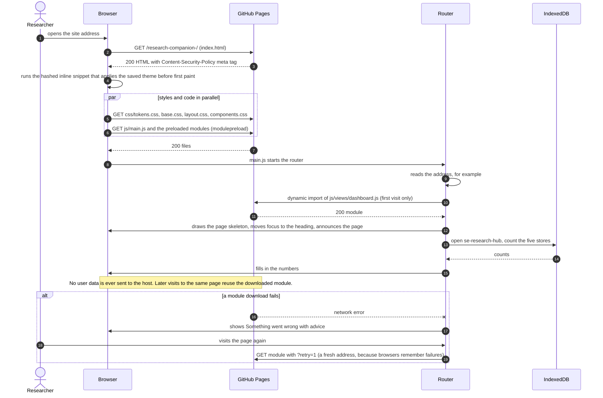
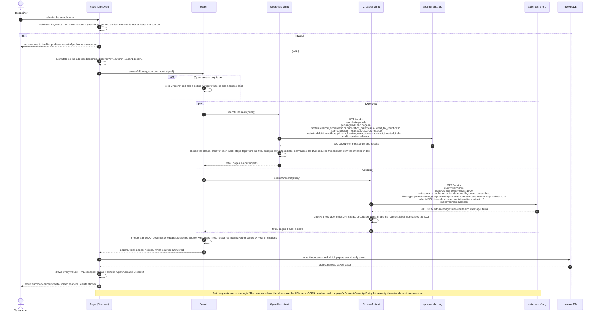
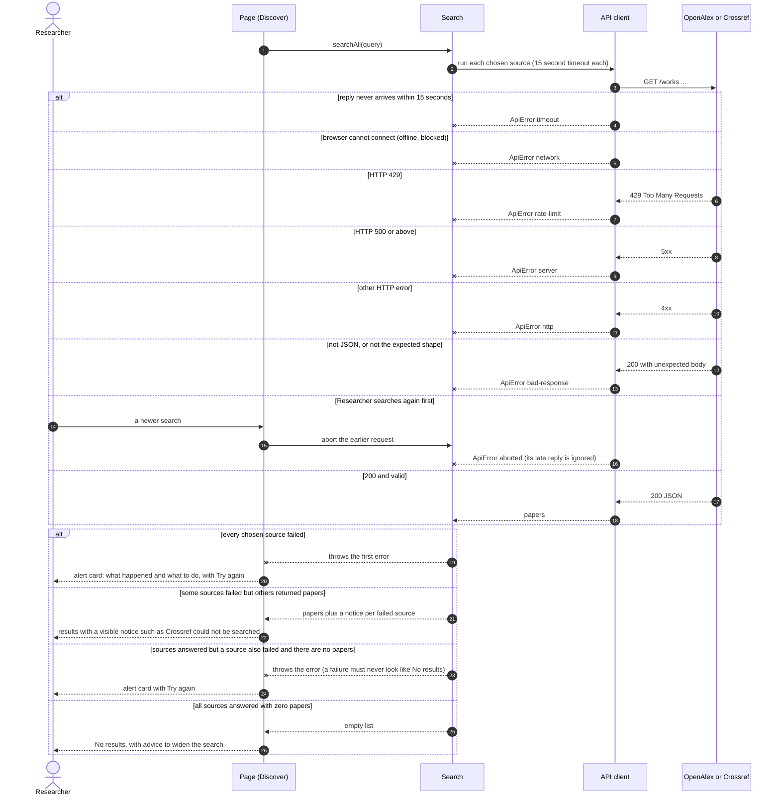
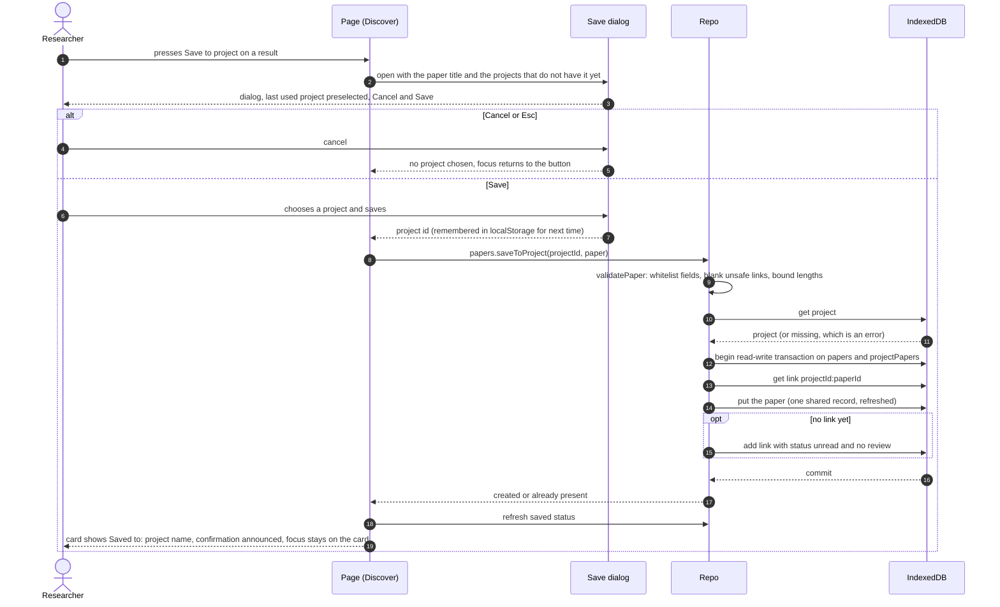
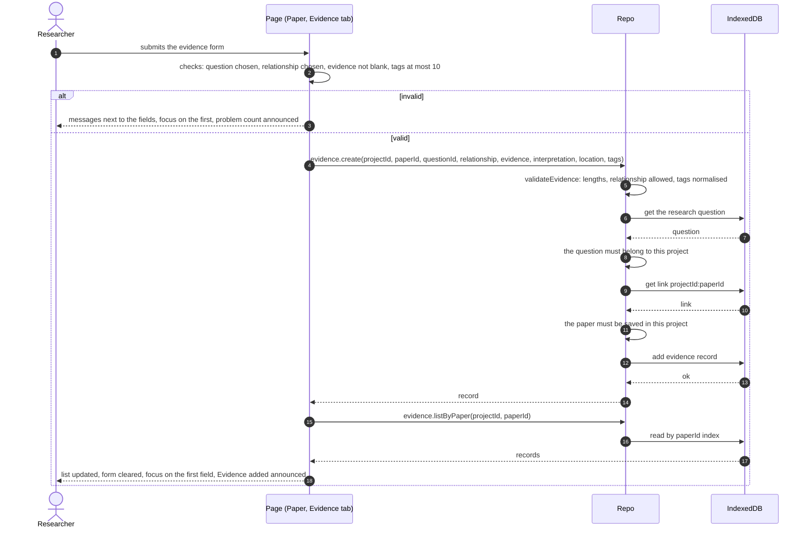
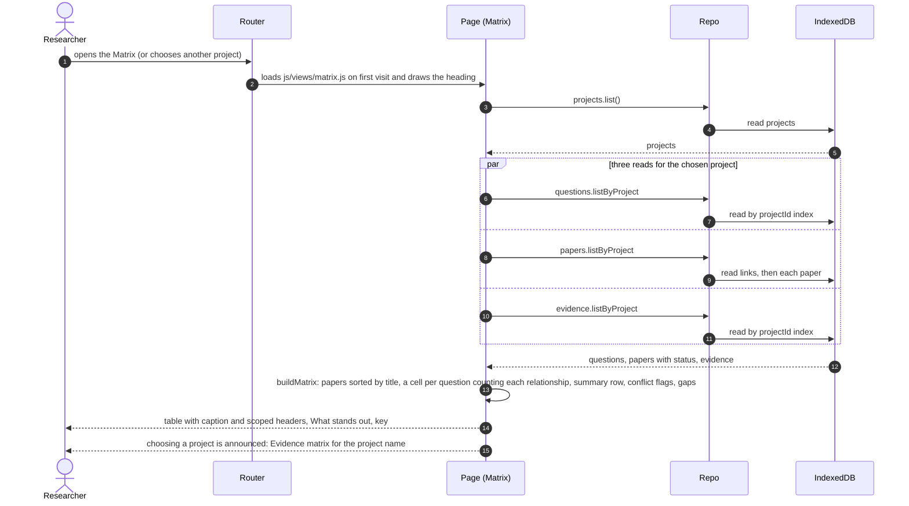
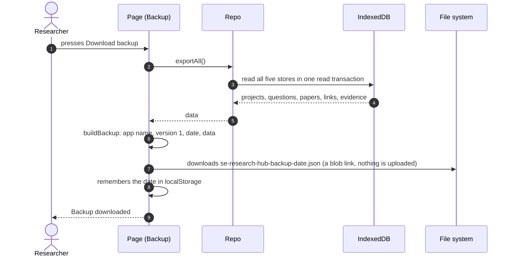
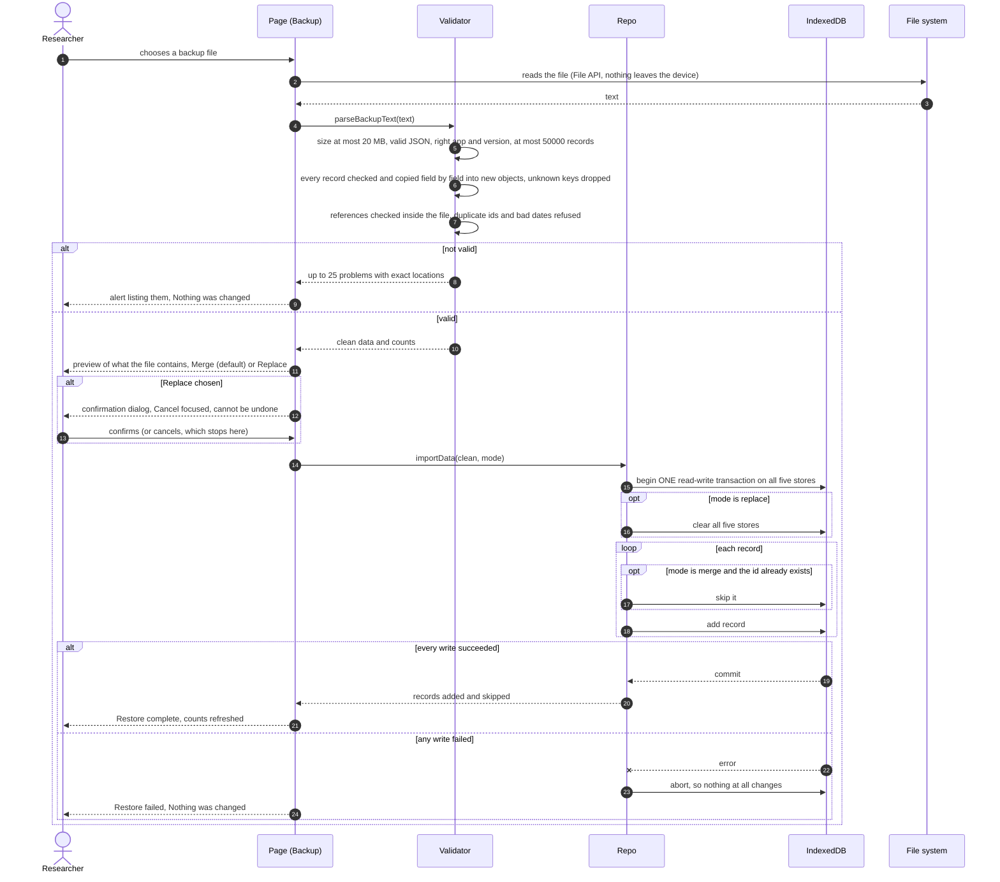

# Interaction sequence diagrams

Each diagram shows who talks to whom, in order, with the **actual requests** the app makes. Solid arrows are calls or requests; dashed arrows are replies.

Participants used throughout:

| Participant | Meaning |
|---|---|
| Researcher | The person using the app |
| Page | The view in the browser (HTML, CSS and the view's JavaScript) |
| Router | `js/router.js`, which shows the page for the address after `#` |
| Search | `js/api/search.js`, which runs the sources in parallel and merges |
| OpenAlex / Crossref clients | `js/api/openalex.js`, `js/api/crossref.js` |
| Repo | `js/db/repository.js`, the only code that touches IndexedDB |
| IndexedDB | The browser's database (`se-research-hub`) |
| GitHub Pages | The static host that serves the app's own files |

## 1. Loading the app and opening a page

<!-- diagram: seq-page-load -->

## 2. Searching: the API calls

<!-- diagram: seq-search -->

## 3. Searching: when something goes wrong

<!-- diagram: seq-search-errors -->

## 4. Saving a paper to a project

<!-- diagram: seq-save-paper -->

## 5. Recording evidence

<!-- diagram: seq-evidence -->

## 6. Viewing the evidence matrix

<!-- diagram: seq-matrix -->

## 7. Backing up and restoring data

<!-- diagram: seq-backup -->

<!-- diagram: seq-restore -->

## 8. API contract summary

| | OpenAlex | Crossref |
|---|---|---|
| **Endpoint** | `GET https://api.openalex.org/works` | `GET https://api.crossref.org/works` |
| **Search text** | `search` | `query` |
| **Paging** | `per-page=20`, `page=n` (the app stops at 10,000 results, 500 pages) | `rows=20`, `offset=(n-1)*20` (same cap) |
| **Sort** | `sort=relevance_score:desc`, `publication_date:desc`, `cited_by_count:desc` | `sort=score`, `published`, `is-referenced-by-count` with `order=desc` |
| **Year filter** | `filter=publication_year:2020-2024` (or `>2019`, `<2025`) | `filter=from-pub-date:2020,until-pub-date:2024` |
| **Open access** | `filter=is_oa:true` | not supported, so the source is skipped when requested |
| **Types** | all | `filter=type:journal-article,type:proceedings-article` |
| **Fields requested** | `select=id,doi,title,display_name,publication_year,type,cited_by_count,authorships,primary_location,open_access,abstract_inverted_index` | `select=DOI,title,author,issued,container-title,abstract,URL,is-referenced-by-count,type` |
| **Identification** | `mailto=<contact address>` (polite pool) | `mailto=<contact address>` (polite pool) |
| **Response shape the app requires** | `{ meta: { count }, results: [...] }` | `{ message: { "total-results", items: [...] } }` |
| **Abstract** | an *inverted index* (`word: [positions]`) rebuilt into text | JATS XML text, tags removed, entities decoded |
| **Credentials** | none | none |
| **Failure handling** | timeout 15 s, network, 429, 5xx, other HTTP, bad response, cancelled (see diagram 3) | same |

Notes
- The formats above are the providers' documented ones. The app's tests use recorded sample responses, and the author confirmed on the live site that real searches return results.
- No API keys exist anywhere in the app, so there is nothing secret to leak. The only identifying value sent is the optional contact address.
- Nothing is retried automatically. A rate-limited or failed search shows what happened and a **Try again** button, so the app never hammers a struggling service.
- The static host is the only other server contacted, and only for the app's own files (diagram 1).
