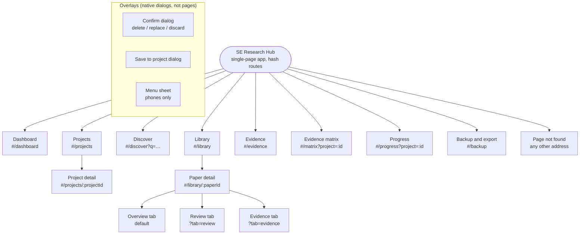
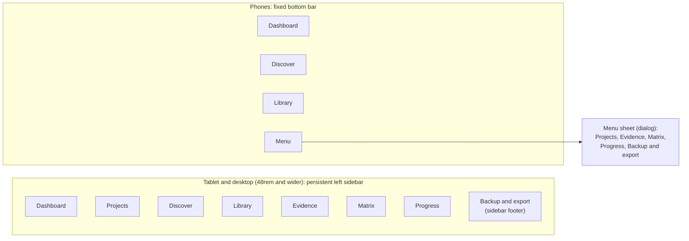
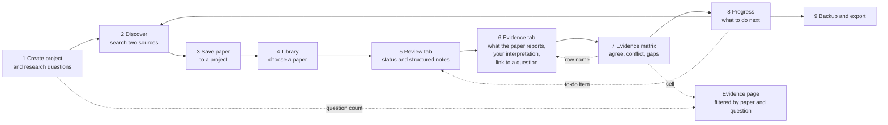

# Site map and navigation

SE Research Hub is a **single-page application**: one HTML file, with the visible page chosen by the address after the `#` (hash routing). That keeps it deployable on any static host with no server rules, and makes every page, filter and paper **linkable and bookmarkable**.

## 1. Site map

<!-- diagram: sitemap -->

Overlays are opened from several pages: the **Save to project** dialog from Discover; the **Confirm** dialog from Projects, Paper detail (evidence, project switching) and Backup (replace); the **Menu sheet** from the phone navigation bar.

## 2. Page inventory

| # | Page | Route | Purpose | Main content |
|---|---|---|---|---|
| 1 | Dashboard | `#/dashboard` | Orientation and quick access | Four counts (projects, questions, saved papers, evidence), getting-started steps, shortcuts, last-backup note |
| 2 | Projects | `#/projects` | List and create literature reviews | Project cards, "New project" form |
| 3 | Project detail | `#/projects/:projectId` | Everything about one project | Research questions (with evidence counts), add-question form, saved papers, project details form, delete |
| 4 | Discover | `#/discover` | Find papers | Search form (keywords, years, sort, open access, sources), merged results, paging, save buttons |
| 5 | Library | `#/library` | All saved papers | Keyword, project, status and sort filters; paper cards with project chips |
| 6 | Paper detail | `#/library/:paperId` | Read, review and extract evidence from one paper | Project picker; tabs: Overview, Review, Evidence |
| 7 | Evidence | `#/evidence` | Everything recorded, across projects | Filters (keyword, project, question, paper, relationship, tag), relationship totals, evidence cards |
| 8 | Evidence matrix | `#/matrix` | Synthesis: where papers agree, conflict or are silent | Papers × questions table, summary row, "What stands out", key |
| 9 | Progress | `#/progress` | What to do next | Reading progress, coverage per question, to-do lists |
| 10 | Backup and export | `#/backup` | Protect and reuse data | JSON backup, validated restore (merge or replace), CSV exports |
| 11 | Page not found | any other address | Recover from a bad link | Links back to Dashboard, Projects, Discover |

## 3. URL scheme (state lives in the address)

| Route | Parameters | Example |
|---|---|---|
| `#/projects/:projectId` | project id (UUID) | `#/projects/6f1c…` |
| `#/discover` | `q` search text, `from`, `to` years, `oa=1` open access only, `sort` = `newest`/`cited`, `src` = `openalex,crossref`, `page` | `#/discover?q=copilot&from=2020&oa=1&sort=cited&page=2` |
| `#/library` | `q`, `project`, `status`, `sort` | `#/library?status=unread&sort=year` |
| `#/library/:paperId` | `tab` = `review`/`evidence`; `project` (which project's review/evidence) | `#/library/doi%3A10.1145%2F3597503.3608128?tab=evidence&project=6f1c…` |
| `#/evidence` | `q`, `project`, `rq` (question id), `paper`, `rel`, `tag` | `#/evidence?project=6f1c…&rq=a2b9…&rel=contradicts` |
| `#/matrix`, `#/progress` | `project` | `#/matrix?project=6f1c…` |

Notes: paper ids contain `/` and `:` (for example `doi:10.1145/3597503.3608128`), so they are URL-encoded in the address. Filters change the address with `history.replaceState` (no history entry per keystroke); a new search uses `pushState`, so Back returns to the previous search.

## 4. Navigation structure by screen size

<!-- diagram: navigation-structure -->

Both layouts share a **skip link** (first focusable element), a **top bar** with the theme toggle, and the same landmarks (`header`, `nav`, `main`). The current page is marked with `aria-current="page"`. The order and labels of the navigation never change between pages (WCAG 3.2.3).

## 5. Typical journey and cross-links

<!-- diagram: journey -->

| From | Link | To |
|---|---|---|
| Matrix cell | evidence for this paper and question | Evidence page filtered by project, question and paper |
| Matrix summary cell | all evidence for the question | Evidence page filtered by project and question |
| Matrix row heading | the paper | Paper detail, Evidence tab |
| Progress to-do item | unread, or read with no evidence | Paper detail, Review tab |
| Progress question card | "View n evidence records" | Evidence page filtered by question |
| Project page, question | "n evidence records" | Evidence page filtered by question |
| Project page, saved paper | Review | Paper detail, Review tab |
| Evidence card | paper title | Paper detail, Evidence tab |
| Library card | paper title | Paper detail |
| Dashboard | shortcuts | Matrix, Progress, Evidence, Projects, Discover |

## 6. Design rationale

- **Hash routing, not path routing.** Static hosts (GitHub Pages) have no rewrite rules, so `/projects/123` would 404 on reload. A hash route needs none, and the app works from any sub-path.
- **Seven main destinations, one footer link.** The research workflow (Discover, Library, Evidence, Matrix, Progress) and its containers (Dashboard, Projects) are the daily destinations; Backup is occasional, so it sits in the sidebar footer and the phone menu.
- **Phone bar holds three, plus Menu.** Thumb reach: the three most-used places are one tap away; the rest are one tap further (the Menu sheet).
- **Paper and tab state in the address.** A researcher can bookmark "this paper's evidence tab in that project", and the Back button behaves predictably.
