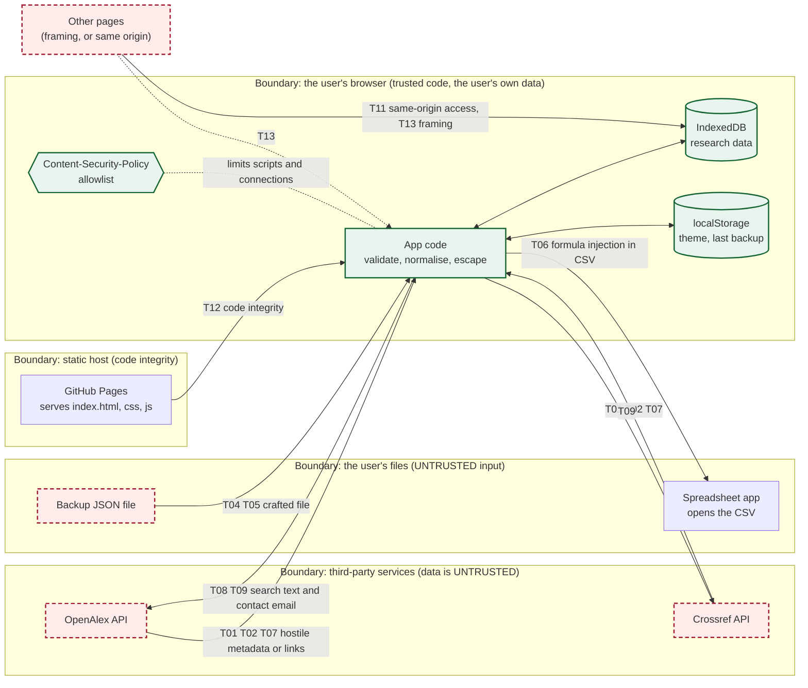
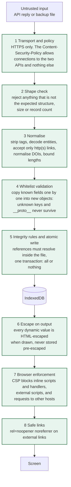
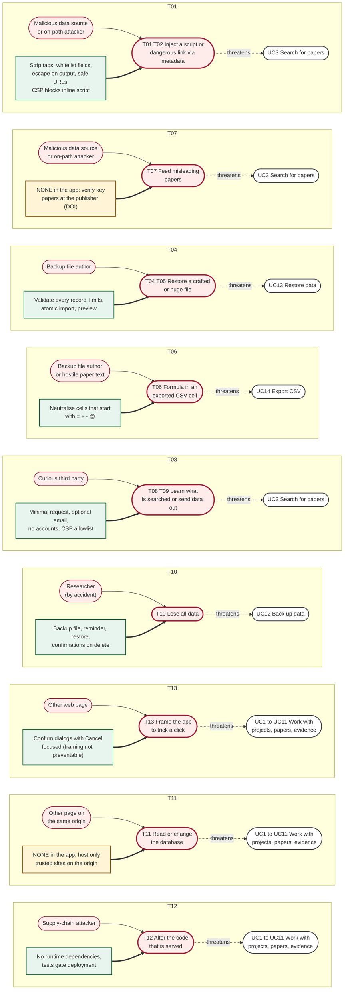
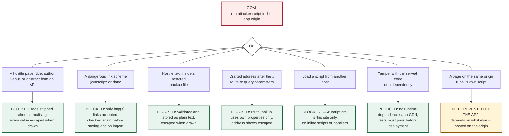
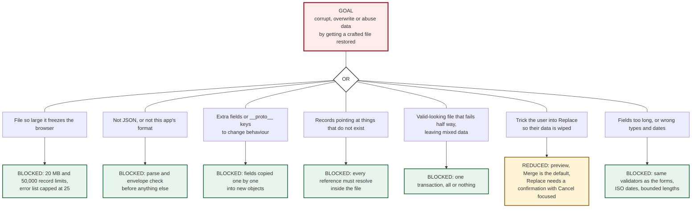

# Threat model

Method: **STRIDE per element** on the data-flow diagrams, then **misuse cases** and **attack trees** for the highest-impact threats. Each threat names its mitigation in the code and the test that proves it. Residual risk is stated, including the risks that are *not* fully solved.

## 1. Scope, assets and assumptions

| Asset | Why it matters |
|---|---|
| **A1 Research data** (projects, questions, reviews, evidence) | The user's real work; only copy is in the browser |
| **A2 Researcher's privacy** | Search terms, and the contact email sent with them |
| **A3 Integrity of the app code** | If the code is altered, everything the app does is untrustworthy |
| **A4 Trust in displayed paper metadata** | Research conclusions rest on it |

**Assumptions.** One user per browser profile; no accounts, passwords, payments or personal data beyond the optional contact email; hosted as static files over HTTPS; the user's device and browser are not already compromised.

**Out of scope.** Attacks needing control of the user's device or browser profile; the security of OpenAlex, Crossref or GitHub themselves (treated as untrusted *data sources* or trusted *hosts* as shown below).

### Threat agents

| ID | Agent | Capability |
|---|---|---|
| TA1 | Compromised or malicious data source, or an on-path attacker | Controls the content of an API reply |
| TA2 | Author of a malicious backup file | Gets the user to restore a crafted file (shared by email or drive) |
| TA3 | Another web page | Frames the app, or runs on the same origin |
| TA4 | Supply-chain attacker | Compromises a dependency, action or hosting account |
| TA5 | Curious third party | Reads network traffic or API logs |
| TA6 | The user, by accident | Deletes or overwrites data, or loses the browser profile |

## 2. Trust boundaries

<!-- diagram: tm-trust-boundaries -->

Every arrow that crosses into the browser from outside carries data that is **checked before use**. The only data that leaves the browser is the search request (and CSV files the user chooses to save).

## 3. Defence in depth for untrusted data

<!-- diagram: tm-defence-layers -->

No single layer is trusted to be perfect: layers 3, 4 and 6 are the primary protections; layers 1 and 7 mean that if one of them ever had a flaw, the browser would still block the most harmful outcomes.

## 4. Misuse cases

Read each row left to right: a **threat agent** (red) performs a **misuse case** (heavy red outline) that *threatens* a legitimate **use case** (white). A **mitigation** (green) is aimed at the misuse case; an **amber** box means the app has **no mitigation of its own** and the risk is handled outside it.

<!-- diagram: tm-misuse-cases -->

Misuse cases **without** a green mitigation are the honest gaps: **T07** (misleading data cannot be detected by the app), **T11** (same-origin pages) and, partly, **T13** (framing). They are discussed in section 7.

## 5. Attack trees

### 5.1 Goal: run attacker script inside the app (and so read or change all research data)

<!-- diagram: tm-attack-tree-script -->

### 5.2 Goal: corrupt or take over the user's data through a restore

<!-- diagram: tm-attack-tree-restore -->

## 6. Threat register (STRIDE)

Likelihood (L) and impact (I): **L**ow, **M**edium, **H**igh. *Residual* is the risk after the mitigations listed.

| ID | STRIDE | Threat | L | I | Mitigation (where) | Evidence | Residual |
|---|---|---|---|---|---|---|---|
| **T01** | Tampering, Elevation | Script injection through paper metadata (titles, authors, venue, abstract) from an API | M | H | Tags stripped on normalising (`js/api/paper.js`); all dynamic values escaped (`esc` in every view); project names set with `textContent`; CSP forbids inline scripts and handlers | `tests/unit/openalex.test.js`, `crossref.test.js`; `tests/e2e/discover.mjs` (hostile author ``; fails when escaping is removed); `security.mjs` | **Low** |
| **T02** | Elevation | `javascript:` or `data:` links in a paper's URL fields | M | H | `safeUrl` allows only http(s) at normalisation, again in `validatePaper`, and on import; CSP | `openalex.test.js`; `discover.mjs`; `backup.test.js` (mutation-checked) | **Low** |
| **T03** | Info disclosure, Tampering | Reverse tabnabbing or referrer leakage through external links | M | M | `target="_blank"` always with `rel="noopener noreferrer"`; link text says it opens a new tab | `security.mjs` | **Low** |
| **T04** | Tampering, Elevation | Crafted backup file: extra fields, `__proto__`, dangling references, wrong types | M | H | Strict validator copies field by field, enforces references, ISO dates, bounded text (`js/backup.js`); atomic import (`js/db/repository.js`); preview before applying | `tests/unit/backup.test.js` (hostile files, round trip, atomic failure; mutation-checked); `tests/e2e/backup.mjs` | **Low** |
| **T05** | Denial of service | Huge or record-heavy backup file | L | M | 20 MB and 50,000-record limits; error list capped at 25 | `backup.test.js` | **Low** |
| **T06** | Tampering (on the user's spreadsheet) | Formula injection through exported CSV cells (`=HYPERLINK(...)`) | M | M | Cells starting `= + - @` tab or CR are prefixed with an apostrophe; RFC 4180 escaping (`js/export.js`) | `backup.test.js`, `backup.mjs` (mutation-checked) | **Low** |
| **T07** | Tampering | On-path attacker or compromised API returns misleading papers | L | M | HTTPS only (CSP lists only `https` API hosts; GitHub Pages enforces HTTPS); response shape checks; treated as untrusted for T01 | `openalex.test.js` (bad shapes), `security.mjs` | **Medium**: the app cannot tell true metadata from false. Verify key papers at the publisher via their DOI. |
| **T08** | Info disclosure | Research data sent to a third party (analytics, injected request) | L | H | No third-party scripts or analytics; CSP `connect-src` allows only the two APIs | `security.mjs` (a `fetch` to another origin is blocked and reported) | **Low** |
| **T09** | Info disclosure | Search terms and the contact email visible to API operators, network tools and (if public) the source | H | L | Only the search request and an optional contact address are sent; no cookies, accounts or identifiers; address is a single config value and may be blank | `docs/deployment.md` warns before deploying | **Medium-Low**: accepted. Use a dedicated address, not a personal one. |
| **T10** | Denial of service (availability), accident | Loss of all data (clear site data, browser eviction, new device, mistaken delete or replace) | H | H | JSON backup and tested restore; dashboard shows last backup; destructive actions confirm with Cancel focused; deletes and imports are transactional | `backup.mjs`, `projects.mjs`, `library.mjs` | **Medium**: the user must actually make backups. |
| **T11** | Spoofing, Tampering, Info disclosure | Another page on the same origin reads or changes the IndexedDB database. On GitHub Pages every project site of one account shares `<user>.github.io`, and storage is per origin, not per path | L | H | None in the app. Keep only trusted sites on that origin; use a custom domain or a separate account to isolate; store no secrets (the app has none) | None (an environment risk) | **Medium** (depends on hosting) |
| **T12** | Tampering | Compromised dependency, GitHub Action or hosting account alters the served code | L | H | **Zero runtime dependencies** and no CDN: all served code is first-party; dev dependencies run only locally and in CI; lockfile committed; deployment is gated on the full test suite | `npm audit`: 0 vulnerabilities; `npm ls --omit=dev` empty | **Low-Medium**: Actions are pinned to major tags, not commit hashes. |
| **T13** | Spoofing, Tampering | Clickjacking: a hostile page frames the app to trick a click | L | M | Static hosting cannot send `X-Frame-Options` or `frame-ancestors` (the `<meta>` form ignores it). Destructive actions need an explicit confirmation | None automated | **Low-Medium** |
| **T14** | Denial of service | API throttling or outage; a slow search blocks the user | M | L | 15 s timeout; partial results; specific messages; no automatic retries; superseded searches cancelled; polite-pool identification | `discover.mjs`, `save.mjs`, `openalex.test.js` | **Low** |
| **T15** | Tampering | Abuse of the address: `#/__proto__`, malformed `%` escapes, markup in the hash | M | L | Route lookup with `Object.hasOwn`; `URLSearchParams`; safe decoding; the address is escaped when shown | `tests/unit/router.test.js`, `polish.mjs` | **Low** |
| **T16** | Tampering, Info disclosure | Someone with the user's browser profile or DevTools reads or edits stored data | L | M | Out of scope: there is no login to protect, and the data is the user's own. Use the device's own login and profile separation | n/a | **Accepted** |
| **T17** | Repudiation | No audit trail of changes | L | L | Single-user local data; every record carries created and updated times | n/a | **Accepted** |

### STRIDE coverage

| Category | Threats |
|---|---|
| **S**poofing | T11, T13 |
| **T**ampering | T01, T02, T03, T04, T06, T07, T11, T12, T13, T15, T16 |
| **R**epudiation | T17 |
| **I**nformation disclosure | T03, T08, T09, T11, T16 |
| **D**enial of service | T05, T10, T14 |
| **E**levation of privilege | T01, T02, T04 |

## 7. Residual risks and recommended next steps

Honest summary: the data-handling risks (T01, T02, T04, T05, T06, T08, T14, T15) are mitigated and tested. The remaining risks are mostly about **where and how it is hosted**, and **user behaviour**:

1. **T11 same-origin sharing (Medium).** The live site is at `https://<user>.github.io/research-companion-/`. Any other Pages site on the same account shares its origin and could read the database. Keep only trusted sites there, or move to a custom domain or a dedicated account for isolation.
2. **T10 data loss (Medium).** Back up regularly. Possible improvement: ask the browser for persistent storage (`navigator.storage.persist()`) and warn when a backup is old.
3. **T07 data truthfulness (Medium).** Treat search results as leads, and check key papers at the publisher through their DOI link.
4. **T09 contact email (Medium-Low).** The address is visible to anyone using the site. Use a dedicated address, or leave it blank.
5. **T12 pipeline (Low-Medium).** Pin GitHub Actions to full commit hashes and enable Dependabot alerts.
6. **T13 framing (Low-Medium).** If the site moves to Cloudflare Pages, add a `_headers` file with `X-Frame-Options: DENY` and a `frame-ancestors 'none'` policy, and move the policy from the `<meta>` tag into a real header.
7. **Not tested by anyone yet:** a professional penetration test or a live-site scan. The automated tests prove the controls work as designed, not that no other flaw exists.

## 8. Security tests at a glance

| Control | Test |
|---|---|
| Hostile metadata is inert | `discover.mjs` (hostile author), `openalex.test.js`, `crossref.test.js`, `security.mjs` |
| Unsafe URLs removed | `openalex.test.js`, `discover.mjs`, `backup.test.js` |
| Backup validation and atomic restore | `backup.test.js` (15+ hostile and broken cases), `backup.mjs` |
| CSV formula safety | `backup.test.js`, `backup.mjs` |
| CSP present, no violations in normal use, injections blocked | `security.mjs` |
| External links safe | `security.mjs` |
| Route and address abuse | `router.test.js`, `polish.mjs` |
| Failure handling for APIs | `discover.mjs`, `save.mjs`, `openalex.test.js`, `merge.test.js` |
| Dependencies | `npm audit` (0 vulnerabilities), zero runtime dependencies |

Several of these were **mutation-checked**: the protection was temporarily removed and the tests were shown to fail, so a passing result is meaningful.
