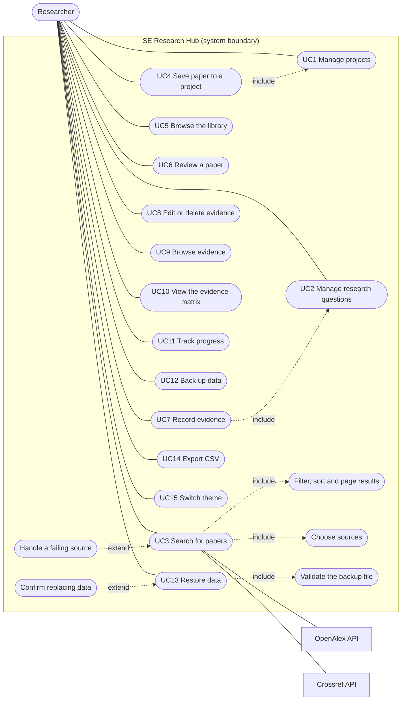

# Use cases

## 1. Actors

| Actor | Type | Role |
|---|---|---|
| **Researcher** | Primary | The only human user: a student or researcher running a literature review. There are no accounts, roles or other users. |
| **OpenAlex API** | Secondary (external system) | Scholarly metadata service queried when the Researcher searches. |
| **Crossref API** | Secondary (external system) | Second scholarly metadata service, queried in parallel. |

Browser storage (IndexedDB) and the file system are part of the Researcher's own browser and device, so they appear in the data-flow diagrams rather than as actors.

## 2. Use case diagram

<!-- diagram: use-case-diagram -->

Notation: solid line = association between an actor and a use case; dashed arrow = `include` (the base use case always uses the other) or `extend` (optional behaviour added to the base use case; the arrow points at the base). "UC4 includes UC1" and "UC7 includes UC2" express a precondition: saving a paper needs a project, and recording evidence needs a research question, so the interface offers to create one.

## 3. Use case list

| ID | Use case | Goal | Where | Key rules |
|---|---|---|---|---|
| UC1 | Manage projects | Create, rename, describe and delete literature reviews | Projects, Project detail | Name 3 to 80 characters; deleting removes its questions, saved-paper links and evidence |
| UC2 | Manage research questions | Add, edit, delete and order the questions a project must answer | Project detail | 10 to 300 characters; numbered RQ1, RQ2… by position; deleting removes evidence recorded against it |
| UC3 | Search for papers | Find candidate papers from two sources | Discover | Keywords 2 to 200 characters; years 1900 to next year, earliest ≤ latest; at least one source |
| UC4 | Save paper to a project | Keep a paper for review | Discover (Save button, dialog) | A paper is stored once and linked to each project; saving twice to one project does nothing |
| UC5 | Browse the library | Find a saved paper again | Library | Filters: keyword, project, reading status; four sorts |
| UC6 | Review a paper | Record status and structured notes | Paper detail, Review tab | One review per paper **per project**; every note ≤ 2,000 characters |
| UC7 | Record evidence | Capture what a paper reports about a question | Paper detail, Evidence tab | Evidence (required) is kept apart from interpretation; relationship chosen deliberately; the question must belong to the same project |
| UC8 | Edit or delete evidence | Correct or remove a record | Paper detail, Evidence tab | Cannot move a record to another paper or project; delete asks first |
| UC9 | Browse evidence | See everything recorded across projects | Evidence | Filters: keyword, project, question, paper, relationship, tag |
| UC10 | View the evidence matrix | See agreement, conflict and gaps | Matrix | Conflict = both Supports and Contradicts for a question; gaps stated in words |
| UC11 | Track progress | Decide what to do next | Progress | Written suggestions; "reviewed" means at least one review field has text |
| UC12 | Back up data | Protect against browser data loss | Backup and export | One JSON file containing all five data sets |
| UC13 | Restore data | Recover or move data | Backup and export | Merge keeps existing records; Replace deletes first (confirmation); all-or-nothing |
| UC14 | Export CSV | Analyse outside the app | Backup and export | Evidence, papers and reviews, or one project's matrix; formula-safe |
| UC15 | Switch theme | Comfortable reading | Top bar | Light or dark; follows the operating system until chosen; saved |

## 4. Use case specifications (key flows)

### UC3 Search for papers
| | |
|---|---|
| **Primary actor** | Researcher |
| **Secondary actors** | OpenAlex API, Crossref API |
| **Preconditions** | The Researcher is online. (Saving needs browser storage but searching does not.) |
| **Trigger** | Submits the search form, or opens a link such as `#/discover?q=copilot`. |
| **Main flow** | 1. The Researcher enters keywords and optional filters. 2. The system validates the form (focus moves to the first problem if invalid). 3. The system records the search in the address. 4. It queries every chosen source **in parallel**. 5. Each response is checked, cleaned and converted to one common paper shape. 6. Results are merged: the same DOI becomes one paper. 7. The system shows the total, the sources used and the papers, and announces the result count to screen readers. |
| **Alternative flows** | **A1 One source fails** (timeout, rate limit, server error, offline): the other source's results are shown with a visible notice. **A2 All sources fail, or a failure would look like "no results"**: an error with a specific explanation and a Try again button. **A3 Open access only is on**: Crossref is skipped (it does not report open access) with a notice. **A4 No results**: advice to widen the search. **A5 The Researcher searches again before results arrive**: the earlier request is cancelled and its late reply ignored. |
| **Postconditions** | Nothing is stored. The search is in the browser's history. |
| **Quality rules** | Every value from an API is untrusted: tags stripped, text escaped when displayed, links limited to http/https. |
| **Tests** | `tests/unit/openalex.test.js`, `crossref.test.js`, `merge.test.js`; `tests/e2e/discover.mjs`, `save.mjs`, `security.mjs` |

### UC4 Save paper to a project
| | |
|---|---|
| **Preconditions** | A search has results; at least one project exists (otherwise the card offers "Create a project"). |
| **Trigger** | Presses **Save to project** on a result. |
| **Main flow** | 1. A dialog asks which project (last used is preselected; projects that already have the paper are not offered). 2. The Researcher confirms. 3. The system validates the paper (field whitelist), then stores the paper once and a link to the project in **one transaction**. 4. The card shows "Saved to: …"; focus stays on the card; a confirmation is announced. |
| **Alternatives** | Cancel or Esc: nothing changes and focus returns to the button. Storage blocked: the card says saving is unavailable. |
| **Postconditions** | The paper appears in the Library and the project. Reading status "Unread". |

### UC7 Record evidence
| | |
|---|---|
| **Preconditions** | The paper is saved in the project; the project has at least one research question. |
| **Trigger** | Submits the Evidence form on the paper's Evidence tab. |
| **Main flow** | 1. The Researcher picks a research question and **a relationship** (Supports, Contradicts, Mixed, Contextual or No evidence; nothing is pre-selected). 2. Writes **what the paper reports**; optionally their **interpretation**, a page or table, and tags. 3. The form validates (required fields, lengths, tag count) and shows specific messages. 4. The system checks integrity (the paper is saved in this project; the question belongs to this project) and stores the record. 5. The list updates, focus returns to the form for the next entry, and "Evidence added" is announced. |
| **Alternatives** | Invalid: focus moves to the first problem and the count of problems is announced. No questions in the project: the tab explains and links to the project page. |
| **Postconditions** | The record counts in the matrix, Evidence page, progress and dashboard. |

### UC10 View the evidence matrix
| | |
|---|---|
| **Preconditions** | A project with research questions and saved papers. |
| **Main flow** | 1. The Researcher chooses a project. 2. The system builds a papers × questions table: each cell shows the relationships recorded (with counts). 3. A summary row totals each question and flags **conflicts**. 4. "What stands out" lists conflicts and gaps as sentences. 5. Choosing a cell opens the evidence behind it. |
| **Alternatives** | No questions or no papers: the page explains what is needed and links to it. |

### UC13 Restore data
| | |
|---|---|
| **Trigger** | Chooses a backup file on the Backup page. |
| **Main flow** | 1. The system reads the file and **validates all of it** before changing anything: envelope, size, counts, every field, references between records. 2. It previews what the file contains. 3. The Researcher chooses **Merge** (default) or **Replace**. 4. For Replace, a confirmation says current data will be deleted and cannot be recovered. 5. The system applies everything in **one transaction**. 6. The result (records added and skipped) is shown. |
| **Alternatives** | Invalid file: up to 25 problems listed with exact locations (for example `evidenceNotes[0].researchQuestionId`) and "Nothing was changed". Failure part-way: the transaction is aborted and nothing changes. |
